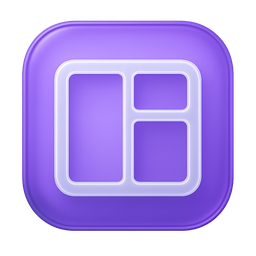
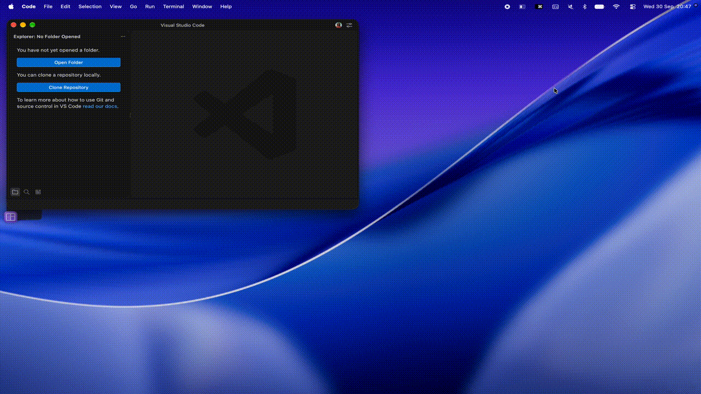
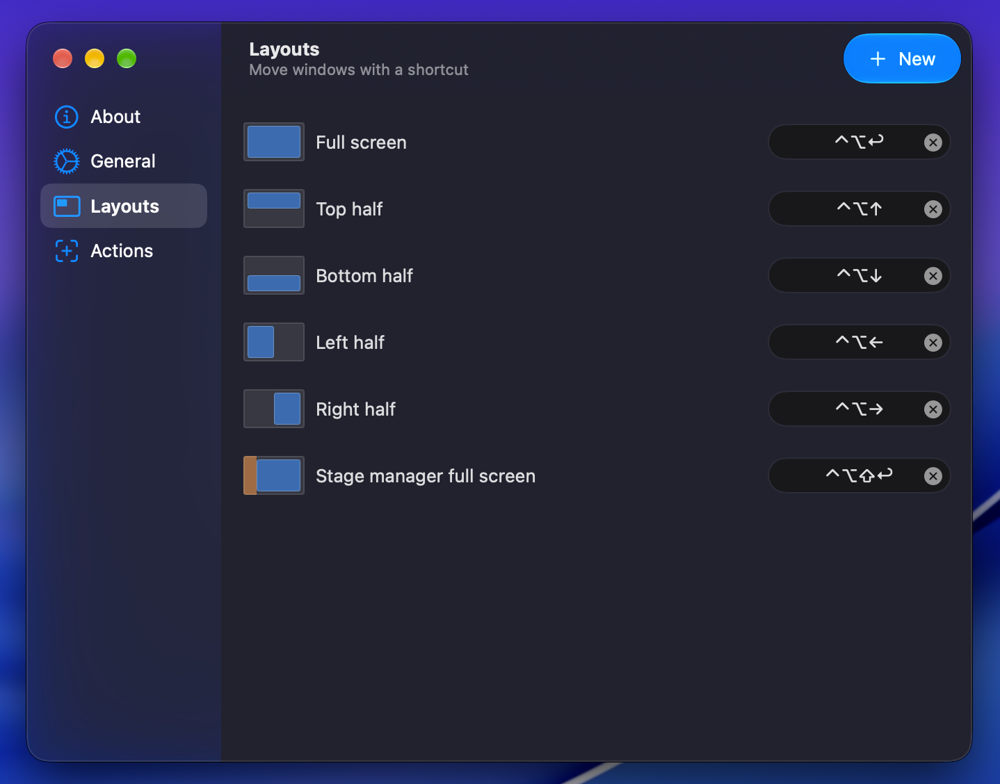
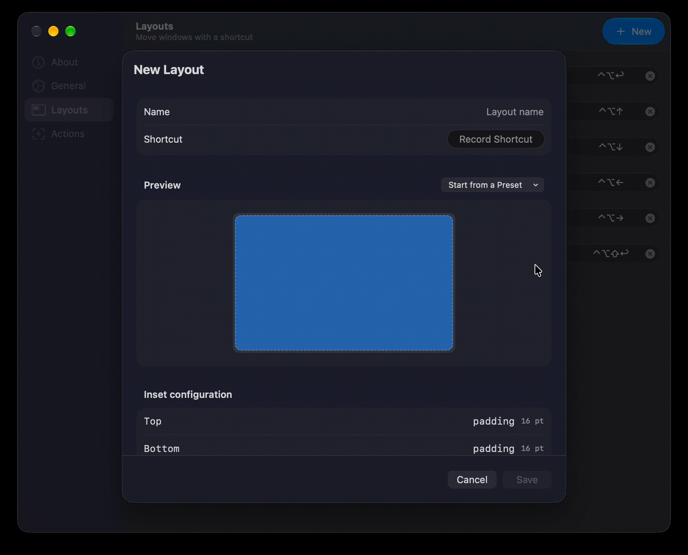
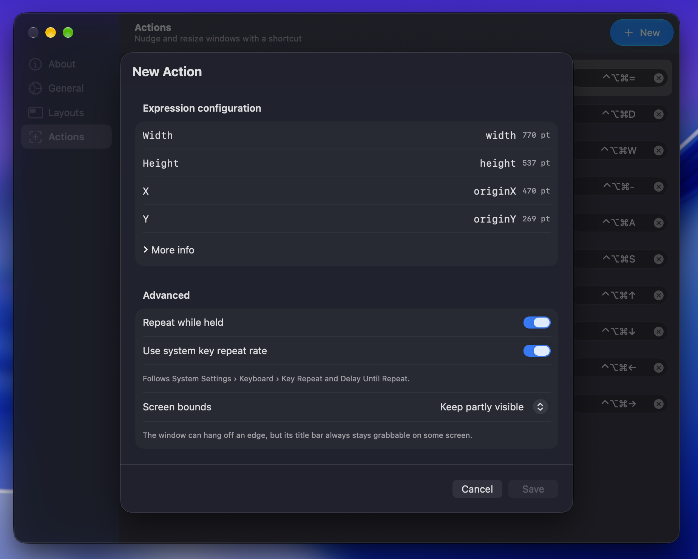
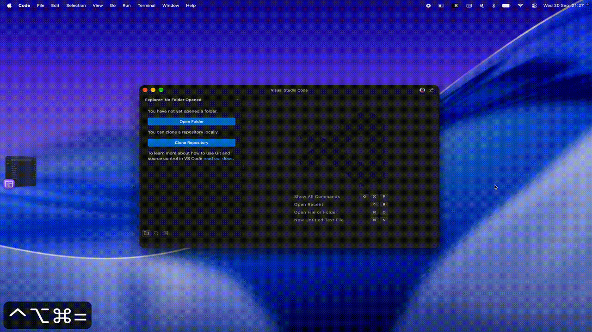
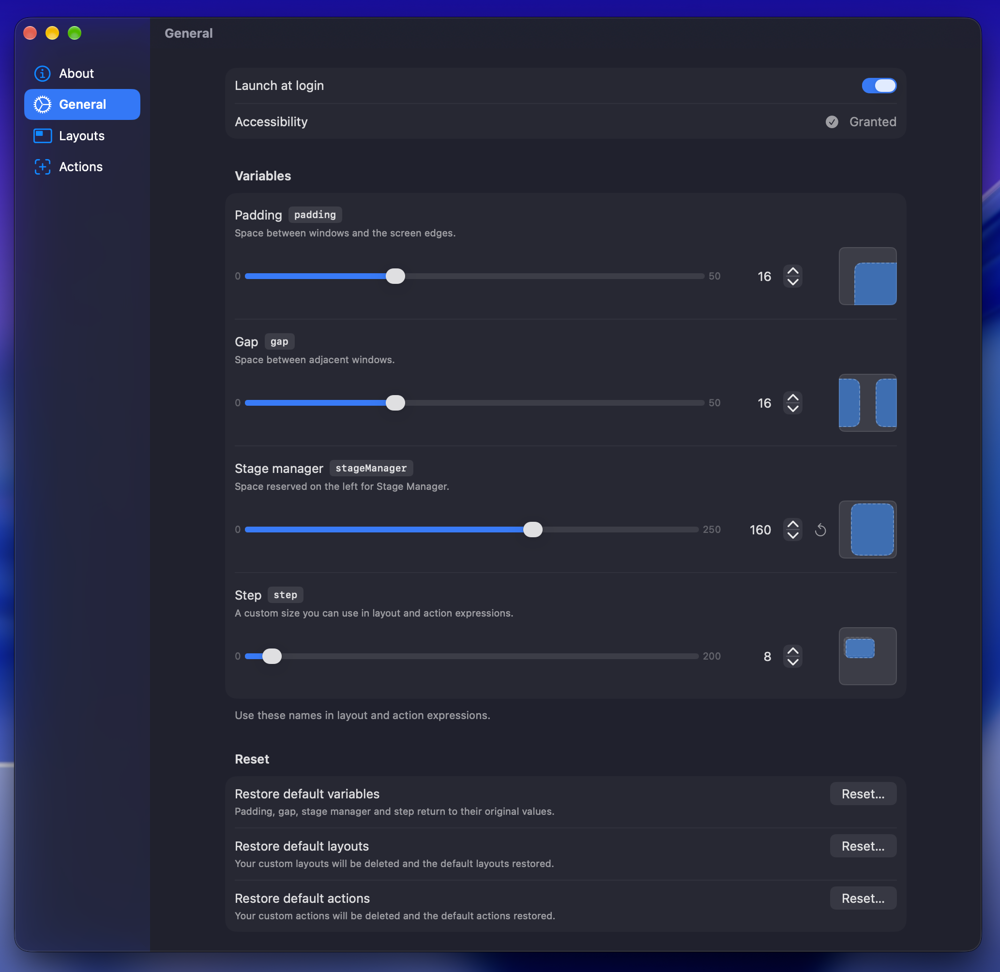

  

<h1 align="center">JV Window Manager</h1>

  <em>Highly customizable shortcut-based window manager for macOS</em>

  
  
  

JV Window Manager lives in the menu bar and moves or resizes the frontmost window with keyboard shortcuts. Position windows on their screen with [_Layouts_](#layouts), or nudge and grow them relative to where they already are with [_Actions_](#actions). Every position is a small math expression, so you're not limited to a fixed grid.

## Features

- **Layouts** - snap the frontmost window into position relative to the visible frame of the screen it's on.
- **Actions** — grow, shrink, or nudge the frontmost window relative to its own current frame. Hold the shortcut to repeat.
- **Expression-based configuration** — every position and size is a small math expression (`width / 2 + halfGap`), with a live preview, an evaluated result next to each field, and variable chips you can click to insert.

## Installation

1. Download the latest build from the [Releases page](https://github.com/JGhignatti/JVWindowManager/releases/latest).
2. Move `JVWindowManager.app` to `/Applications`.
3. Launch it and grant **Accessibility** access when prompted (shortcuts won't move or resize windows until it's granted).

Requires macOS 14 Sonoma or later.

## Layouts

Layouts define the window's new position and size relative to the **screen's visible frame**. Each side (top, bottom, left, right) is an inset expression: the distance from that edge of the screen to the new edge of the window.

### Default layouts

| Layout                    | Default shortcut                                                              |
| :------------------------ | :---------------------------------------------------------------------------- |
| Full screen               | <kbd>control</kbd> + <kbd>option</kbd> + <kbd>return</kbd>                    |
| Top half                  | <kbd>control</kbd> + <kbd>option</kbd> + <kbd>&nbsp;▲&nbsp;</kbd>             |
| Bottom half               | <kbd>control</kbd> + <kbd>option</kbd> + <kbd>&nbsp;▼&nbsp;</kbd>             |
| Left half                 | <kbd>control</kbd> + <kbd>option</kbd> + <kbd>&nbsp;◀&nbsp;</kbd>             |
| Right half                | <kbd>control</kbd> + <kbd>option</kbd> + <kbd>&nbsp;▶&nbsp;</kbd>             |
| Stage manager full screen | <kbd>control</kbd> + <kbd>option</kbd> + <kbd>shift</kbd> + <kbd>return</kbd> |

### Custom layouts

Create your own from the **Layouts** tab: give it a name and a shortcut, then set the Top, Bottom, Left and Right expressions. You can start from a preset instead of writing expressions from scratch.

#### Variables available in layout expressions

| Variable       | Description                              |
| :------------- | :--------------------------------------- |
| `width`        | The width of the screen's visible frame  |
| `height`       | The height of the screen's visible frame |
| `padding`      | The configured padding size              |
| `gap`          | The configured gap size                  |
| `halfGap`      | Half the configured gap size             |
| `stageManager` | The configured stage manager size        |
| `step`         | The configured step size                 |

Expressions support `+`, `-`, `*`, `/` and parentheses.

## Actions

While layouts are relative to the screen, actions are relative to the window's **own current** position and size. Each action expression sets the window's new width, height, and top-left position (`x`, `y`), evaluated from its current frame.

### Default actions

| Action       | Default shortcut                                                                       |
| :----------- | :------------------------------------------------------------------------------------- |
| + All sides  | <kbd>control</kbd> + <kbd>option</kbd> + <kbd>command</kbd> + <kbd>&nbsp;=&nbsp;</kbd> |
| + Horizontal | <kbd>control</kbd> + <kbd>option</kbd> + <kbd>command</kbd> + <kbd>&nbsp;D&nbsp;</kbd> |
| + Vertical   | <kbd>control</kbd> + <kbd>option</kbd> + <kbd>command</kbd> + <kbd>&nbsp;W&nbsp;</kbd> |
| - All sides  | <kbd>control</kbd> + <kbd>option</kbd> + <kbd>command</kbd> + <kbd>&nbsp;–&nbsp;</kbd> |
| - Horizontal | <kbd>control</kbd> + <kbd>option</kbd> + <kbd>command</kbd> + <kbd>&nbsp;A&nbsp;</kbd> |
| - Vertical   | <kbd>control</kbd> + <kbd>option</kbd> + <kbd>command</kbd> + <kbd>&nbsp;S&nbsp;</kbd> |
| Move up      | <kbd>control</kbd> + <kbd>option</kbd> + <kbd>command</kbd> + <kbd>&nbsp;▲&nbsp;</kbd> |
| Move down    | <kbd>control</kbd> + <kbd>option</kbd> + <kbd>command</kbd> + <kbd>&nbsp;▼&nbsp;</kbd> |
| Move left    | <kbd>control</kbd> + <kbd>option</kbd> + <kbd>command</kbd> + <kbd>&nbsp;◀&nbsp;</kbd> |
| Move right   | <kbd>control</kbd> + <kbd>option</kbd> + <kbd>command</kbd> + <kbd>&nbsp;▶&nbsp;</kbd> |

### Custom actions

Create your own from the **Actions** tab, the same way as layouts: name, shortcut, and Width, Height, X and Y expressions, with presets to start from.

#### Variables available in action expressions

| Variable       | Description                                                 |
| :------------- | :---------------------------------------------------------- |
| `width`        | The current width of the window                             |
| `height`       | The current height of the window                            |
| `originX`      | The window's current left edge, from the screen's left edge |
| `originY`      | The window's current top edge, from the screen's top edge   |
| `padding`      | The configured padding size                                 |
| `gap`          | The configured gap size                                     |
| `halfGap`      | Half the configured gap size                                |
| `stageManager` | The configured stage manager size                           |
| `step`         | The configured step size                                    |

Expressions support `+`, `-`, `*`, `/` and parentheses.

### Repeat while held

By default, holding an action's shortcut repeats it, following your system's **Key Repeat** and **Delay Until Repeat** settings. You can turn this off, or switch to a custom initial delay (100–1000 ms) and repeat interval (10–500 ms).

### Screen bounds

Actions can be configured with how far they're allowed to push a window off-screen:

| Option                        | Behavior                                                                                  |
| :---------------------------- | :---------------------------------------------------------------------------------------- |
| Keep partly visible (default) | The window can hang off an edge, but its title bar always stays grabbable on some screen. |
| Clamp to all screens          | The window can move between displays, but never past the outer edges of your setup.       |
| Clamp to current screen       | The window stays fully inside the screen it started on.                                   |
| No clamping                   | The window is moved or resized exactly as configured, with no safety limits.              |

## Settings

| Setting       | Description                                                                                            | Default value | Range     |
| :------------ | :----------------------------------------------------------------------------------------------------- | :------------ | :-------- |
| Padding       | The space between the edge of the screen and the window's available space                              | `16`          | `0...50`  |
| Gap           | The space between windows                                                                              | `16`          | `0...50`  |
| Stage manager | The left margin for the stage manager, between the edge of the screen and the window's available space | `180`         | `0...250` |
| Step          | A configurable size that can be used as a step size for repeating actions                              | `8`           | `0...200` |

## Building from source

1. Clone the repository.
2. Open `JVWindowManager.xcodeproj` in Xcode.
3. Build and run the `JVWindowManager` scheme.

Built with [Defaults](https://github.com/sindresorhus/Defaults), [KeyboardShortcuts](https://github.com/sindresorhus/KeyboardShortcuts), and [LaunchAtLogin](https://github.com/sindresorhus/LaunchAtLogin-Modern) by Sindre Sorhus, and [Expression](https://github.com/nicklockwood/Expression) by Nick Lockwood.

Maintainers cutting a new version should see [RELEASING.md](RELEASING.md).

## License

[MIT](LICENSE) © [João Ghignatti](https://github.com/JGhignatti)
